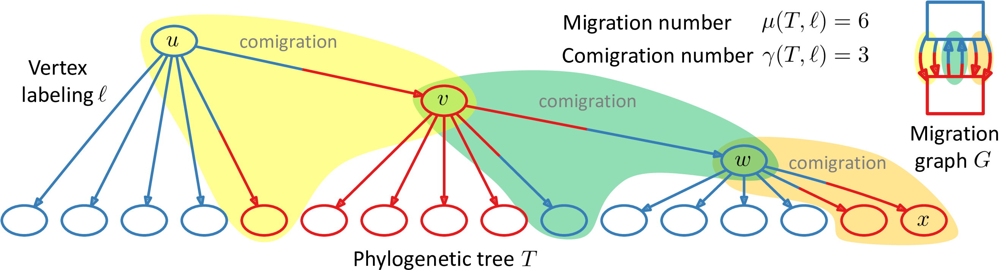

# Fixed parameter tractable algorithm for `PMH` where `𝒫 = {S}`

In the Parsimonious Migration History (PMH) problem, we are given a phylogenetic tree `T` with `n` vertices and a set `𝒫` of allowed migration patterns. Each leaf of `T` is labeled by one of `m` locations. We are asked to label each internal vertex of `T` by a location such that: (i) the pattern of the resulting migration graph respects `𝒫`, (ii) we minimize the migration number and (iii) subsequently the comigration number. Here, we give a fixed parameter tractable (FPT) algorithm that runs in time `O(nm^m)` for the case where the resulting migration graph is restricted to a tree.

## Contents

  1. [Compilation instructions](#compilation)
     * [Dependencies](#dep)
     * [Compilation](#comp)
  2. [Usage instructions](#usage)
     * [I/O formats](#io)
       - [Clone tree](#clonetree)
       - [Leaf labeling](#leaflabeling)
       - [Vertex labeling](#vertexlabeling)
     * [FPT algorithm (`pmh-s-dp`)](#fpt)

## Compilation instructions

### Dependencies

PMH-S is written in C++11 and thus requires a modern C++ compiler (GCC >= 4.8.1, or Clang). In addition, PMH-S has the following dependencies.

* [CMake](http://www.cmake.org/) (>= 2.8)
* [Boost](http://www.boost.org) (>= 1.38)
* [LEMON](http://lemon.cs.elte.hu/trac/lemon) graph library (>= 1.3)

[Graphviz](http://www.graphviz.org) is required to visualize the resulting DOT files, but is not required for compilation.

In case [doxygen](http://www.stack.nl/~dimitri/doxygen/) is available, source code documentation will be generated.

### Compilation

To compile PMH-S, execute the following commands from the root of the repository:

    $ mkdir build
    $ cd build
    $ cmake ..
    $ make

The compilation results in the executable `pmh-s-dp`.

## Usage instructions

### I/O formats

Below we describe the various formats used by `pmh-s-dp`.

#### Phylogenetic tree

A phylogenetic tree is provided as an edge list. Each line specifies a directed edge by listing the labels of first the source vertex and then the target vertex separated by a space or tab character. For example:

    root a
    root b
    root P
    a a1
    a a2
    ...

See [T.tree](data/T.tree) for the complete phylogenetic tree.

#### Leaf labeling

A leaf labeling assigns a location to each leaf of a phylogenetic tree. Each line contains two values, the leaf label and then the location separated by a space or tab character. For example:

    a1 x
    a2 x
    a3 y
    b1 y
    ...

See [T.labeling](data/T.labeling) for the complete leaf labeling.

#### Vertex labeling

A vertex labeling assigns a location to each vertex of a phylogenetic tree (including the leaves). Each line contains two values, the vertex label and then the location separated by a space or tab character. For example:

    b3 x
    b2 y
    b1 y
    a3 y
    a2 x
    a1 x
    P P
    b x
    a x
    root P

This vertex labeling is obtained by `pmh-s-dp` as described next.

### FPT algorithm (`pmh-s-dp`)

    Usage:
      ./pmh-s-dp [--help|-h|-help] [-o str] -p str T leaf_labeling
    Where:
      T
         Clone tree
      leaf_labeling
         Leaf labeling
      --help|-h|-help
         Print a short help message
      -o str
         Output prefix
      -p str
         Primary location

An example execution:

    $ ./pmh-s-dp -p P ../data/T.tree ../data/T.labeling -o .
    DP-	5	2	5	5	0.00030303

The output lists the migration number, the comigration, the migration number, the migration number and then the running time in seconds. In addition, the resulting vertex labeling is given in the file `DP-T-P.labeling`. To visualize the vertex labeling, use the following command:

    $ dot -Tpng DP-T-P.dot -o DP-T-P.png
